# NeuralStage — User Manual

**Live Guitar Rig for Plugin Players**
Version 0.2.1 · Atij 666 Studio

---

## Contents

1. [What NeuralStage is](#1-what-neuralstage-is)
2. [Installation](#2-installation)
3. [First-time setup](#3-first-time-setup)
4. [Window layout overview](#4-window-layout-overview)
5. [Top row — Amp knobs](#5-top-row--amp-knobs)
6. [Second row — Signal chain strip](#6-second-row--signal-chain-strip)
7. [Left rail — Input / Sweet Spot / Auto Level / Tuner](#7-left-rail--input--sweet-spot--auto-level--tuner)
8. [Centre — NAM XY morph pad](#8-centre--nam-xy-morph-pad)
9. [Right rail — Pitch / Doubler](#9-right-rail--pitch--doubler)
10. [Sweet Spot meter (TOO COLD / PERFECT / TOO HOT)](#10-sweet-spot-meter)
11. [Stats bar (CPU / latency / glitch counter)](#11-stats-bar)
12. [Scene bar (NEURAL · SCENE 1-4 · STAGE)](#12-scene-bar)
13. [Bottom toolbar](#13-bottom-toolbar)
14. [Hosted plugin windows](#14-hosted-plugin-windows)
15. [Presets](#15-presets)
16. [MIDI control](#16-midi-control)
17. [Footswitch wizard](#17-footswitch-wizard)
18. [Looper](#18-looper)
19. [Backing track](#19-backing-track)
20. [Noise gate](#20-noise-gate)
21. [Offline render](#21-offline-render)
22. [Project bundles & crash recovery](#22-project-bundles--crash-recovery)
23. [Themed dialogs](#23-themed-dialogs)
24. [Troubleshooting](#24-troubleshooting)
25. [Credits](#25-credits)
26. [Changelog](#26-changelog)

---

## 1. What NeuralStage is

NeuralStage is a **standalone live performance host** for guitarists and
bassists who play through plugin rigs. It is designed in the spirit of Gig
Performer, MainStage and Patchworx, but built around the **Neural Amp Modeler
(NAM)** capture format and a no-clutter, stage-friendly UI.

### Headline feature: 4-NAM XY blending

NeuralStage's signature feature is the **XY morph pad** in the centre of
the window. You can load **four different NAM captures** (A / B / C / D)
into the four corners and drag a puck around to blend between them in
real time -- run all four NAM models simultaneously, mix the corners,
automate the puck from MIDI or save the morph position into scenes and
presets. This lets you build a single rig face that contains, for example,
a clean Fender in A, a crunchy Vox in B, a high-gain Mesa in C and a fuzz
in D, and dial between them on stage without switching patches.

> **Hardware note.** Running four NAM models in parallel is heavier than
> running one. NeuralStage will happily do it on most modern CPUs (any
> recent 4-core or better), but very large WaveNet captures combined with
> a small audio buffer can spike CPU. The **Stats bar** (CPU%) and the
> **GLITCH** counter make it obvious when you are pushing the system; if
> you see glitches, raise the buffer size, use lighter captures, or leave
> only the two corners you actually need loaded -- empty slots are free.

Signal flow:

```
INPUT -> Pre-FX VST3 (Gate / Comp / Drive / Mod*) -> NAM Amp (A/B/C/D blend)
      -> IR slot (third-party IR loader VST3) -> Post-FX VST3 (EQ / Mod* / Delay / Reverb / Limit / Master FX)
      -> Pitch / Doubler -> Output gain -> safety gate -> OUTPUT
```

`(* MOD can sit either before or after the NAM amp -- toggle via right-click on the MOD slot.)`

Everything is driven from a single non-modal window. Power on, plug in, play.

---

## 2. Installation

NeuralStage ships as a single Windows installer.

1. Run **`NeuralStage-0.2.1-Setup.exe`**.
2. Accept the default location (`C:\Program Files\Atij 666 Studio\NeuralStage\`).
3. Tick "Create a desktop shortcut" if you want one (off by default).
4. Click **Install**. The installer offers to launch the app at the end.

The installer places:

- `NeuralStage.exe` — the standalone host; hosts **VST3 and LV2** plugins
  in its signal-chain slots.
- `NeuralStage.vst3` → `C:\Program Files\Common Files\VST3\NeuralStage.vst3\` —
  NeuralStage itself as a VST3 plugin for DAWs.
- `NeuralStage.clap` → `C:\Program Files\Common Files\CLAP\` —
  NeuralStage itself as a CLAP plugin for DAWs.
- `NeuralStage.ico`
- `Docs\NeuralStage-Manual.pdf` (this manual — all screenshots embedded)
- An uninstaller registered in **Apps & Features**.

User data (scenes, presets, audio device, MIDI assignments) lives outside
the install folder, so uninstalling or reinstalling NeuralStage never
touches your settings:

- `%AppData%\NeuralStage\` -- scenes, chain state, audio device, MIDI maps
- `Documents\NeuralStage\Presets\` -- preset files

**System requirements**: 64-bit Windows 10/11, a multi-core CPU (4 cores or
better recommended -- see §1 hardware note for the 4-NAM blending), and a
low-latency audio interface with an ASIO driver. VST3 and LV2 plugins
are indexed automatically from their standard system locations on first SCAN.

---

## 3. First-time setup

On first launch NeuralStage opens with **MUTE INPUT** active — your input
meter shows signal, but nothing reaches the amp until you click **MUTE** off.
This prevents surprise feedback the first time you plug in.

1. Click **SETUP** in the bottom toolbar -> **Audio / MIDI Settings...**
2. Pick your audio interface, sample rate, buffer size.
3. Tick the MIDI input devices you want NeuralStage to listen to.
4. Close the dialog.
5. Click the red **MUTE** badge on the INPUT knob to un-mute.
6. Click **SCAN** (left end of the signal chain strip) the first time only —
   NeuralStage will index every VST3 and LV2 plugin it can find on the system paths.

NeuralStage remembers your last audio device, sample rate, buffer size, and
the last active scene across launches.

---

## 4. Window layout overview


The window is a single fixed-aspect rig face divided into seven zones:

```
+--------------------------------------------------------+
|  AMP KNOBS  (9 knobs across the top, INPUT..AIR)       |
+--------------------------------------------------------+
|  SCAN | GATE | COMP | DRIVE | NAM | IR | EQ | MOD |    |
|       | DELAY | REVERB | LIMIT | MASTER FX | EDIT      |  signal-chain strip
+-----+----------------------------------+---------------+
| IN  |                                  |  PITCH /      |
| sweet|        NAM XY  MORPH PAD        |  DOUBLER      |
| auto|  A / B / C / D + centre puck     |  4 knobs      |
| tunr|                                  |               |
+-----+----------------------------------+---------------+
|       [ TOO COLD | PERFECT | TOO HOT ]                 |  sweet-spot meter
+--------------------------------------------------------+
|       CPU% | smp@Hz | latency | GLITCH count           |  stats bar
+--------------------------------------------------------+
|  NEURAL  [SCENE1] [SCENE2] [SCENE3] [SCENE4]  STAGE    |  scene bar
+--------------------------------------------------------+
|  LOOPER SETUP PRESETS A UNDO REDO MIDI BPM SPEC BACK   |  bottom toolbar
+--------------------------------------------------------+
```

---

## 5. Top row — Amp knobs

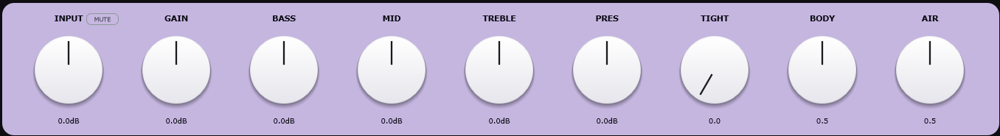

Nine knobs across the top, all centre-detented, all MIDI-learnable
(right-click any knob -> **MIDI Learn**, **Reset**, **Type Value**, **Copy**,
**Paste**).

| Knob | Range | Default | Acts on |
|---|---|---|---|
| **INPUT** | -24 .. +24 dB | 0 dB | Input gain trim into the rig. |
| **GAIN** | -24 .. +24 dB | 0 dB | Pre-gain into the NAM model (amp drive). |
| **BASS** | -12 .. +12 dB | 0 dB | Low-shelf EQ before the cab. |
| **MID** | -12 .. +12 dB | 0 dB | Mid-band EQ before the cab. |
| **TREBLE** | -12 .. +12 dB | 0 dB | Treble EQ before the cab. |
| **PRES** | -12 .. +12 dB | 0 dB | Master output level after the cab. |
| **TIGHT** | 0 .. 1 | 0.0 | High-pass tightener before the amp. |
| **BODY** | 0 .. 1 | 0.5 | Low-mid character around 250 Hz. |
| **AIR** | 0 .. 1 | 0.5 | Top-end shimmer above 8 kHz. |

The **INPUT** knob has a small red **MUTE** overlay button at its top-right.
Click to toggle input muting. Red = muted. The button is on by default on
first launch — un-mute when you're ready.

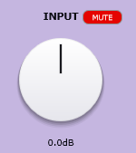

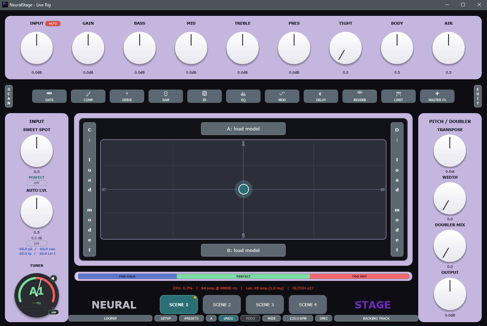

---

## 6. Second row — Signal chain strip

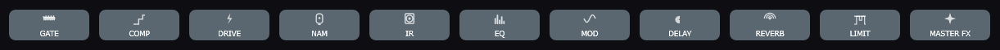

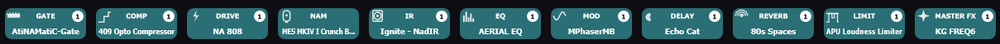

A horizontal strip of fixed category slots. Left bookend is **SCAN**, right
bookend is **EDIT**. The middle slots, in audio order:

| Slot | Category | Position | Notes |
|---|---|---|---|
| **GATE** | Noise gate | Pre-FX | Your own VST3 gate (independent of the built-in safety gate, §20). |
| **COMP** | Compressor | Pre-FX | |
| **DRIVE** | Drive / Overdrive / Fuzz | Pre-FX | |
| **NAM** | NAM amp slot | (built-in) | Highlighted in teal when loaded. Click to open the slot menu (§8). |
| **IR** | Cab IR loader | Post-FX | **Not built-in.** Left-click to pick any third-party IR loader VST3 (Cab Lab, NadIR, MConvolutionEZ, Two Notes Wall of Sound, etc.). The IR slot is pre-categorised so only `IRLoader`-category plugins appear in the picker. Highlighted in teal when a plugin is loaded. |
| **EQ** | EQ | Post-FX | |
| **MOD** | Modulation | Pre or Post | Right-click -> **Move before NAM** / **Move after NAM**. |
| **DELAY** | Delay | Post-FX | |
| **REVERB** | Reverb | Post-FX | |
| **LIMIT** | Limiter / Maximiser | Post-FX | |
| **MASTER FX** | Anything | Post-FX | Free slot for any extra processor. |

Per-slot interaction:

- **Left-click** a slot -> picker popup with all installed plugins (VST3, LV2)
  filtered to that category. Pick one to load it.
- **Right-click** a slot -> menu: **Bypass**, **Edit** (open editor),
  **Remove**, **Replace...**, **MIDI Learn bypass**, and (for the MOD slot)
  **Move before NAM** / **Move after NAM**.
- Each loaded slot shows a small numeric badge with the plugin's current
  preset index / parameter snapshot.
- The active **NAM** slot is highlighted in teal when a model is loaded; the **IR** slot is highlighted in teal when an IR loader plugin is loaded.

**SCAN** (left bookend): re-index plugin folders (VST3, LV2). Right-click for
**Add folder...**, **Remove folder...**, **List "needs authentication" plugins**.

**EDIT** (right bookend): opens the **Chain Editor** popup, a per-slot
detailed view with **Up / Down / Bypass / Remove / Edit** controls and a
free-form **Add anywhere** category browser.

---

## 7. Left rail — Input / Sweet Spot / Auto Level / Tuner

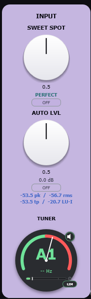

Vertical "INPUT" lavender panel on the left. From top to bottom:

- **SWEET SPOT knob** (0..1, default 0.5)
  Where in the dynamic envelope the gate / compressor sits. Higher = hotter
  into the amp. Below the knob is a **PERFECT** status indicator (lit
  cyan = perfect, blue = too cold, red = too hot).
- **ON / OFF toggle** under the SWEET SPOT knob (default OFF) — when OFF,
  the DI passes through unprocessed.
- **AUTO LVL knob** (0..1, default 0.5)
  Auto-leveller macro. Keeps the perceived loudness consistent across
  pickups and patches. Has its own **ON / OFF** toggle.
- **Loudness readouts** under the AUTO LVL knob:
  `-60.0 pk OFF -60.0 rms / -60.0 tp / -70.0 LU-I`
  - **pk** = peak (dBFS)
  - **rms** = average loudness (dBFS RMS)
  - **tp** = true peak (dBTP)
  - **LU-I** = integrated loudness (LUFS, ITU-R BS.1770)
  - `OFF` = auto-leveller bypassed; the digit before it is current gain
    reduction in dB.
- **TUNER** — chromatic tuner gauge at the bottom of the rail. Shows the
  detected note + cents offset. Tiny **speaker icon** at the upper-right
  mutes the output while tuning. Tiny **LIM** badge at the lower-right
  toggles a click-prevention limiter while you tune through a chain that
  might feed back.

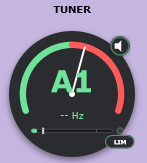

---

## 8. Centre — NAM XY morph pad

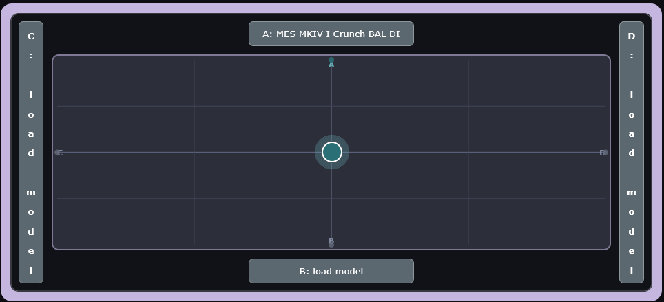

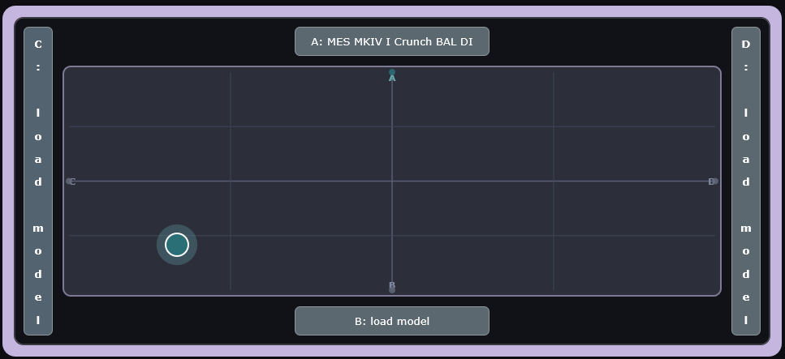

The middle of the window is a 2-D **XY morph pad** between four NAM amp
slots loaded into the corners. **This is NeuralStage's headline feature**
(see §1) -- four NAM captures running simultaneously, blended in real time:

- **A** — top edge button
- **B** — bottom edge button
- **C** — left edge vertical label
- **D** — right edge vertical label
- **Centre puck** — drag freely to blend between the four slots in real
  time. Centre position = equal blend of all four loaded slots.

**Left-click** any slot button to toggle that slot **active / bypassed**
(teal = active, dim = bypassed). A bypassed slot is excluded from the
blend and costs no CPU. **Right-click** any slot button to open its
context menu.

### How the blend works

The puck's X position controls the **C <-> D** axis (left/right) and the
Y position controls the **A <-> B** axis (top/bottom). The four corner
weights are computed continuously and summed before the IR stage, so you
are not crossfading between presets -- all loaded slots are processing
your input every sample, in parallel, at all times. Empty slots cost
nothing.

**The blend is loudness-preserving and click-free by design:**

- **Equal-power crossfade.** Slot weights are derived by inverse-distance
  from the puck to each anchor, normalised across *only the loaded slots*,
  then square-rooted so the sum of the squared amplitudes is always 1.
  This keeps perceived loudness constant as you move the puck between any
  combination of anchors -- there is no level dip at the centre and no
  bump at the edges. Empty slots never "steal" energy from the mix.
- **No tone colouring.** Each NAM model runs at the **native sample rate
  it was trained at**, via an internal high-quality resampler (the same
  approach as Steven Atkinson's reference NAM plugin). The host audio is
  resampled into and out of each model's native rate transparently, so a
  48 kHz capture sounds identical whether your session runs at 44.1, 48,
  96 or 192 kHz. There is **no global oversampling stage** colouring the
  signal -- the only processing the host adds is the gain blend itself.
- **Click-free moves and slot swaps.** Every weight change (puck drag,
  loading or clearing a slot, bypassing a slot) is smoothed over a ~20 ms
  ramp on the audio thread, so even fast moves and live slot changes are
  free of zipper noise and clicks.
- **Bit-transparent when empty.** With no model loaded and the DI makeup
  set to 0 dB, the NAM stage is a true pass-through -- the host adds
  nothing to your signal.

### Output level / loudness normalization

Each slot can match its loudness to a fixed internal reference
(**-18 dBu**, the same reference as the NAM-Modeler plugin), so swapping
or blending captures does not jump the level. Per-model loudness is read
from the capture's own metadata; captures without metadata pass at unity.
Three output modes mirror the reference plugin:

- **Raw** -- normalization OFF; you hear the capture exactly as captured
  (hot captures stay hot, quiet captures stay quiet).
- **Normalized** *(default)* -- every model is gain-matched to the
  -18 dBu reference, so perceived level stays constant across patches.
- **Calibrated** -- normalization ON, intended for use with a calibrated
  DI input level that matches the model's training reference.

Use cases:

- **Clean → dirty morph on a single song.** Load a clean amp in A, a
  crunch in B, and ride the Y-axis with a MIDI expression pedal.
- **Cab/mic position blending.** Load four captures of the same amp with
  different mic placements to dial in a tone live.
- **Style switching.** Load a Fender in A, Vox in B, Mesa in C, fuzz in D
  and jump corner-to-corner between songs without a patch change.

### Hardware caveat

Four large WaveNet captures with a 64-sample buffer at 96 kHz will tax
any CPU. If the **Stats bar** (§11) shows the **GLITCH** counter rising
or CPU% pinned, do one of:

- Raise the audio buffer size (SETUP -> Audio / MIDI Settings).
- Use lighter captures (LSTM models are cheaper than WaveNet).
- Leave one or two corners empty -- empty slots are skipped entirely.
- Disable **Normalize loudness** on slots you do not need it on.

**Per-slot right-click menu** (right-click a slot button):

- **Choose file...** (`.nam` capture)
- **Clear slot**
- **Recent NAMs** (sub-menu with the last 10 used, plus **Clear list**)

**Panel right-click menu** (right-click anywhere on the LCD panel background, not on a slot button):

- **Normalize NAM output (-18 dBu)** — loudness-match all slots to the -18 dBu reference.
- **Bypass NAM** — bypass the entire NAM amp stage (all four slots at once).

Dragging the puck pushes an undo snapshot on drag-start so you can
**UNDO** an exploratory blend (see §13).

---

## 9. Right rail — Pitch / Doubler

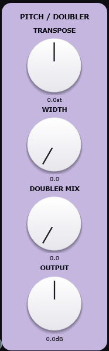

Vertical lavender panel on the right. Four knobs:

| Knob | Range | Default | Acts on |
|---|---|---|---|
| **TRANSPOSE** | -12 .. +12 st | 0 st | Real-time pitch shift of the input (granular). |
| **WIDTH** | 0 .. 1 | 0.0 | Stereo spread of the doubler image (0 = mono, 1 = wide). |
| **DOUBLER MIX** | 0 .. 1 | 0.0 | Doubler wet / dry blend. |
| **OUTPUT** | -24 .. +24 dB | 0 dB | Master output gain, post-FX, pre-safety-limiter. |

The doubler is a short delayed-and-detuned copy of the dry signal; combined
with **WIDTH** it can produce convincing 12-string and "double-tracked
guitar" effects.

---

## 10. Sweet Spot meter

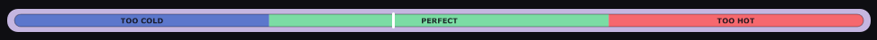

A horizontal three-zone bar sitting between the centre area and the stats
bar:

`[ TOO COLD (blue) | PERFECT (green) | TOO HOT (red) ]`

The lit zone reflects the live state of the input envelope. Aim for
**PERFECT** when setting your guitar volume / interface gain so the NAM
model is hit at its calibrated capture level.

---

## 11. Stats bar

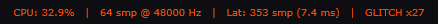

Red mono text strip with four readouts:

- **CPU: X.X%** — average DSP load on the audio thread.
- **N smp @ Hz** — current audio block size and sample rate.
- **Lat: N smp (M ms)** — combined audio + plugin latency.
- **GLITCH xN** — running count of dropouts / underruns since the app
  started. Anything other than `x0` means raise your buffer size or close
  background apps.

---

## 12. Scene bar

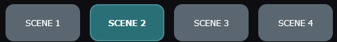

A row across the bottom with the **NEURAL** wordmark on the left, four
**SCENE 1..SCENE 4** buttons in the middle, and the **STAGE** wordmark on
the right.

- **Click NEURAL or STAGE** -> opens the About dialog.
- **Click a SCENE button** -> recall that scene (gapless, click-free).
- **Right-click a SCENE button** -> menu: **Rename**, **Set scene gain
  offset (dB)**, **Capture current rig into this scene**, **Reset scene**,
  and a **MIDI Learn footswitch** entry (press your switch to bind a
  footswitch to that scene -- see §17).

Each scene is a complete snapshot of the rig: NAM slots A/B/C/D + XY puck
position, per-slot bypass / on-off state, IR, all knob values, every loaded
plugin's state, gate settings, tempo. Switching is **click-free**: on every
scene recall the master output is briefly ducked (a few-millisecond fade
out / hold / fade in) across the swap, so any chain or NAM-model
discontinuity is inaudible -- there are no pops, clicks, or silence gaps
regardless of how different the two scenes are. Scalar parameters can also
**morph** smoothly across a configurable window (right-click a scene ->
morph time). The last active scene is restored on next launch.

---

## 13. Bottom toolbar

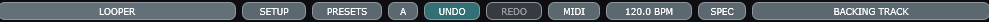

Ten buttons below the scene bar:

| Button | Function |
|---|---|
| **LOOPER** | Open the looper window (free-floating, always on top — §18). |
| **SETUP** | Audio / MIDI Settings. **Right-click** for a full menu: Audio/MIDI, Noise Gate, Offline Render, Export / Import project bundle, Diagnostic zip, Open log folder. |
| **PRESETS** | Open the preset browser (§15). |
| **A / B** | A/B compare toggle. Click to flip. **Right-click** for **Copy A->B**, **Copy B->A**, **Reset B**. |
| **UNDO** | Step back through every parameter change, plugin add/remove, scene recall, XY pad drag. |
| **REDO** | Replay the last UNDO. |
| **MIDI** | Open the Footswitch Wizard (§17). **Right-click** for **Send MIDI Panic (All Notes Off)**, **MIDI Assignments...** table, **Offline Render**. |
| **120.0 BPM** | Live tempo. Click rhythmically to tap-tempo. **Right-click** for sync-to-host, type-BPM, half / double. |
| **SPEC** | Toggle the spectrum analyser overlay across the centre of the window. |
| **BACKING TRACK** | Open the backing-track player (§19). |

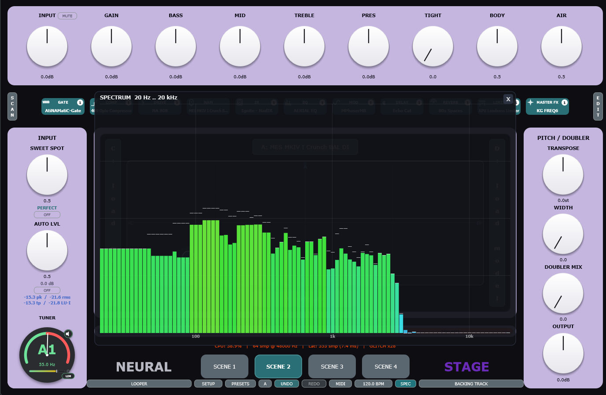

---

## 14. Hosted plugin windows

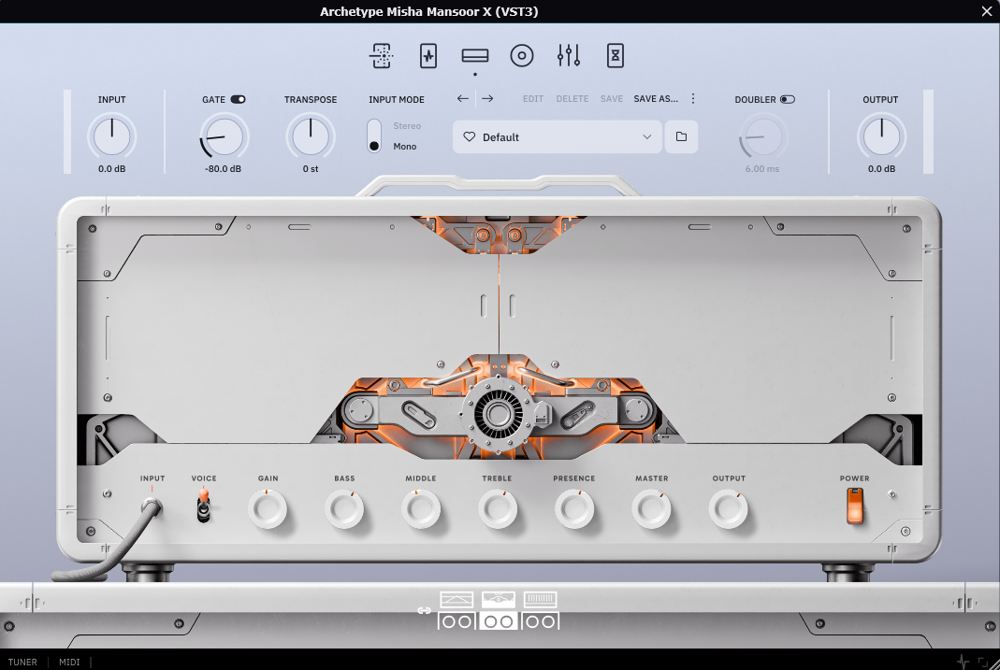

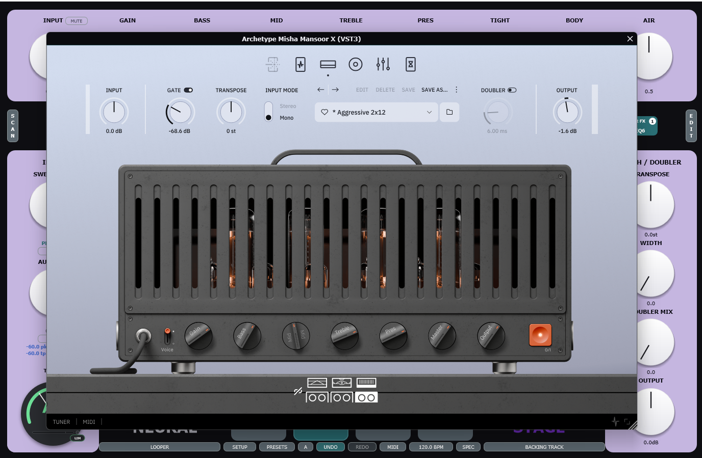

Every hosted VST3 opens in a window framed in the NeuralStage theme — dark
title bar, themed close button, accent stripe. The plugin's own UI is shown
**unaltered** inside.

- Closing the window does **not** remove the plugin from the chain; it just
  hides the editor. Re-open from the slot's right-click -> **Edit**.
- Plugin editors are **always-on-top** — clicking the main window will not
  bury them.

---

## 15. Presets

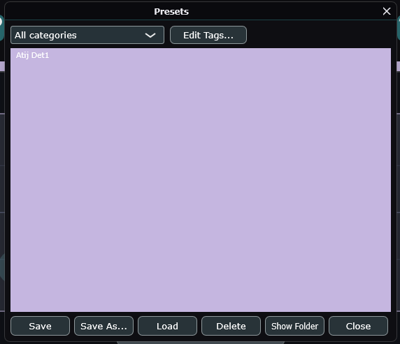

Open via **PRESETS** in the bottom toolbar.

A preset is a **complete, self-contained rig bank**. It captures
**everything** the rig knows: NAM slots, IRs, every plugin's state, all
**four scenes** (each with its own NAM models, XY position, chains and
knobs), the scene that was active when you saved, tempo, gate settings,
and knobs. It does **not** capture your audio device choice.

> **Each preset carries its own four scenes.** Loading a preset swaps the
> entire 4-scene bank and recalls the scene that was active when the preset
> was saved -- so switching presets changes the *sound* of every scene, not
> just the SCENE button labels. To bake your current scenes into a preset,
> set up all four scenes (capture each one), then **Save** / **Save As**.
> Presets saved before v0.2.0 are loaded as a single state for backward
> compatibility -- re-save them to attach the new scene bank.

| Button | Function |
|---|---|
| **Save** | Overwrite the currently-selected preset file. |
| **Save As...** | Write a new `.nspreset` file. |
| **Load** | Load the selected preset. |
| **Delete** | Move the selected preset to the OS trash. |
| **Show Folder** | Open the preset folder in Explorer / Finder. |
| **Edit Tags...** | Themed two-step editor: first set Category (*Clean / Crunch / Lead / ...*), then comma-separated tags. |

The list supports filtering by category and free-text search.

---

## 16. MIDI control

NeuralStage assigns MIDI CCs / notes to almost any parameter.

### Quick learn (in-app)

1. **Right-click** any knob, slot, or button.
2. Choose **MIDI Learn**.
3. Move the physical controller. NeuralStage captures the next incoming
   message and binds it.
4. Right-click again to **MIDI Clear** or **Edit Range**.

### MIDI Assignments table

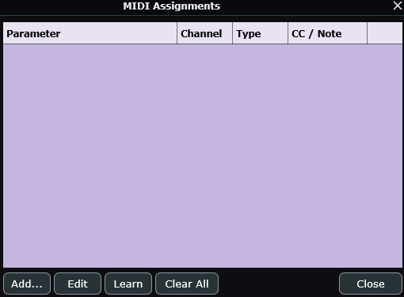

**MIDI** (bottom toolbar) -> right-click -> **MIDI Assignments...** lists
every active binding. From the table you can **Add**, **Edit**, **Delete**,
or **Clear All**.

### MIDI Panic

**MIDI** (bottom toolbar) -> right-click -> **Send MIDI Panic (All Notes
Off)**. Sends an All Notes Off + All Sound Off on every channel through
every loaded plugin. Useful if a stuck note happens during a set.

> **MIDI input stays live across the settings dialog.** Opening **Audio /
> MIDI Settings** lets you enable / disable MIDI input devices there.
> NeuralStage re-asserts its MIDI listeners every time that dialog closes,
> so MIDI Learn and footswitches keep working without an app restart, and
> controllers hot-plugged while the app is running are picked up
> automatically.

---

## 17. Footswitch wizard

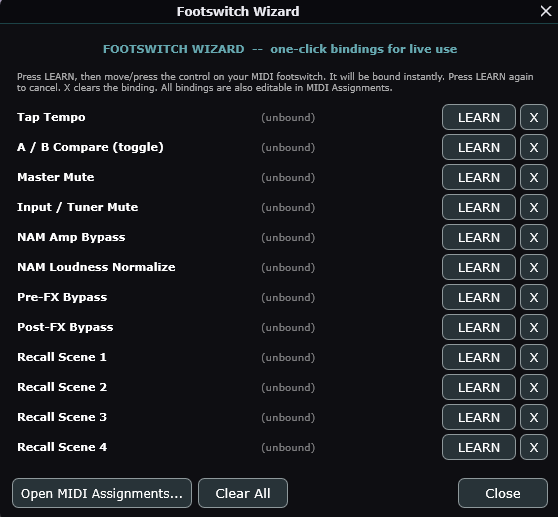

Left-click **MIDI** in the bottom toolbar opens the wizard. It's a one-page
panel showing the twelve common live-show footswitch targets:

- Tap Tempo
- A / B Compare (toggle)
- Master Mute
- Input / Tuner Mute
- NAM Amp Bypass
- NAM Loudness Normalize
- Pre-FX Bypass
- Post-FX Bypass
- Recall Scene 1
- Recall Scene 2
- Recall Scene 3
- Recall Scene 4

Each row has a **Learn** button. Press it, then stomp a footswitch. Done.
Existing assignments are shown with a **Clear** button. Use **Open Full
Table** to drop into the normal MIDI Assignments dialog (§16) for advanced
mappings.

---

## 18. Looper

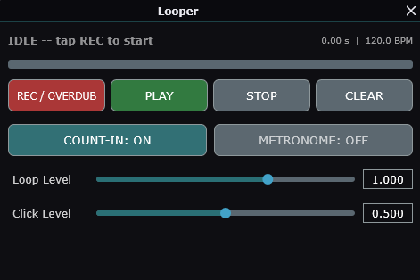

**LOOPER** (bottom toolbar). A free-floating, always-on-top panel so you
can switch scenes while looping.

| Button | Function |
|---|---|
| **REC / OVERDUB** | First press: record. Subsequent presses: overdub on top. |
| **PLAY** | Play the loop. |
| **STOP** | Stop playback (loop preserved). |
| **CLEAR** | Erase the loop. |
| **COUNT-IN** | Toggle the 4-beat count-in before recording. |
| **METRONOME** | Toggle the click during record / play. |

Loop length is quantised to the current BPM if **Count-in** is on; free-form
if off.

---

## 19. Backing track

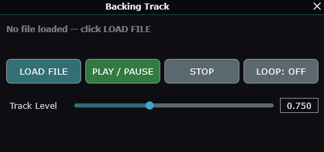

**BACKING TRACK** (bottom toolbar). Free-floating, always-on-top panel for
jamming over a stereo audio file.

| Button | Function |
|---|---|
| **LOAD FILE** | Pick a `.wav`, `.aiff`, `.flac`, `.ogg`, or `.mp3`. |
| **PLAY / PAUSE** | Toggle playback. |
| **STOP** | Reset to start. |
| **LOOP** | When ON, the track loops back to start at the end. |
| **TRACK LEVEL** | Backing-track volume from 0% to 200%. |

A progress bar across the top shows playback position; the filename and
play / pause state are shown in the banner.

---

## 20. Noise gate

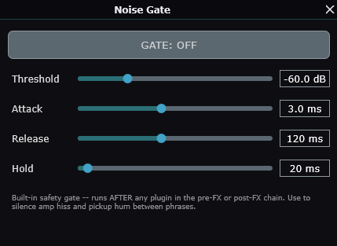

**SETUP** (right-click) -> **Noise Gate...** Free-floating, always-on-top.

A post-FX **safety gate** that runs after the entire chain. Independent of
any user-loaded gate plugin in the **GATE** slot.

| Knob | Range | Default |
|---|---|---|
| **Threshold** | -80 .. 0 dB | -60 dB |
| **Attack** | 0.1 .. 50 ms | 3 ms |
| **Release** | 5 .. 2000 ms | 120 ms |
| **Hold** | 0 .. 500 ms | 20 ms |
| **GATE ON / OFF** | toggle | OFF |

Use it to silence amp hiss and pickup hum between phrases without ducking
into the body of your notes.

---

## 21. Offline render

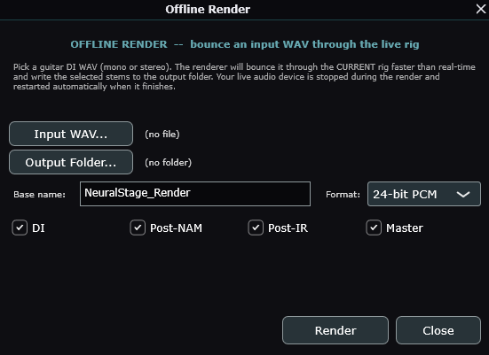

**SETUP** (right-click) -> **Offline Render Stems...** or **MIDI**
(right-click) -> **Offline Render**.

Bounce a guitar DI WAV through the **current rig**, faster than real-time.
Your live audio device is stopped during the render and restarted
automatically when it finishes.

| Field | Description |
|---|---|
| **Input WAV** | Mono or stereo guitar DI. |
| **Output Folder** | Where the stems are written. |
| **Base name** | Filename prefix for the stems. |
| **Format** | 16-bit PCM, 24-bit PCM, or 32-bit float. |
| **Stems** | Tick any of: **DI**, **Post-NAM**, **Post-IR**, **Master**. |

Click **Render**. When the render completes, NeuralStage offers to
**Open Folder** so you can drop the stems straight into your DAW.

All settings are remembered for the next render.

---

## 22. Project bundles & crash recovery

### Project bundles (.nsproject)

**SETUP** (right-click) -> **Export project bundle...** — write a single
`.nsproject` zip that contains every preset, every scene, and every recently
used `.nam` and IR file referenced by your current rig. Drop it on any other
machine running NeuralStage and use **Import project bundle...** to restore
the same setup verbatim.

### Crash recovery

Every 30 seconds NeuralStage auto-saves the current rig state to disk. If
the app crashes or is killed, the next launch will detect the unclean
shutdown and show a themed dialog:

> **Session restored**
>
> The previous session ended unexpectedly. Your chain, scenes, and NAM
> slots have been restored from the most recent auto-save (within 30
> seconds of the crash).
>
> Input is muted on launch -- unmute when you're ready.

Click **OK** to dismiss. The app stays open and ready to play.

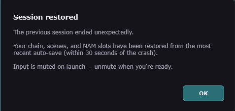

### Diagnostic zip

**SETUP** (right-click) -> **Save diagnostic zip to Desktop...** bundles
the last few log files and the current crash sentinel into one zip on your
Desktop. Use this if you want to file a bug report.

---

## 23. Themed dialogs

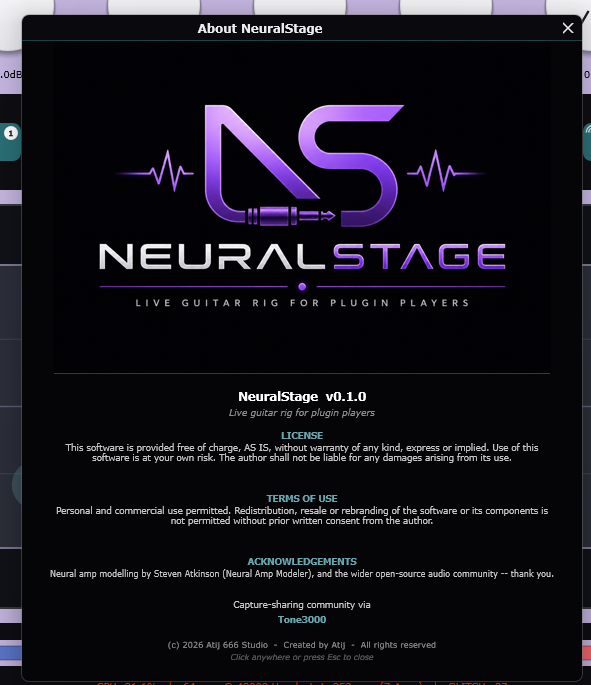

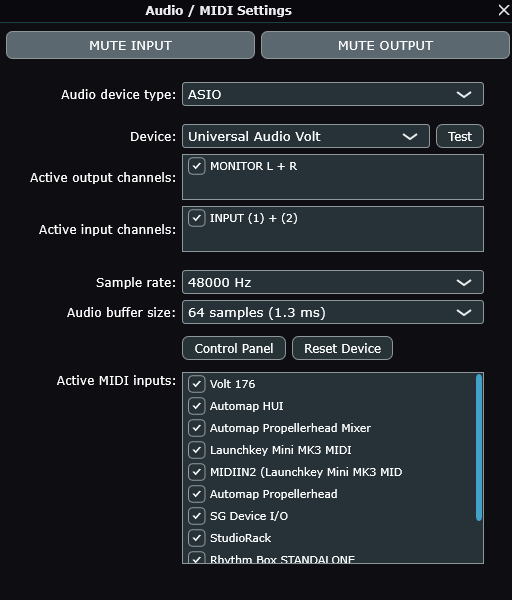

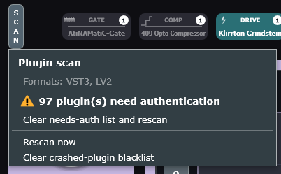

Every pop-up, alert, dialog, and hosted plugin window uses the
app theme. There is no system-native chrome anywhere. Things to verify on
this build:

- Alert / warning / info pop-ups are **in-app overlays** (no taskbar entry,
  no native title bar).
- Tool dialogs (Presets, MIDI Assignments, Footswitch Wizard, About,
  Audio / MIDI Settings, Offline Render, Noise Gate, Looper, Backing
  Track) use a **dark themed title bar** with a themed close button.
- Hosted plugin editors open in the same themed window frame and are
  **always on top** of the main window.
- Looper, Backing Track, and Noise Gate windows are also **always on top**
  so they don't get buried when you click a Scene button.
- The **NEURAL** and **STAGE** wordmarks on the scene bar are clickable
  and open the About dialog.
- All displayed text is UTF-8 clean — no `â` / `\u0080` / `\u0094`
  mojibake artefacts anywhere.

---

## 24. Troubleshooting

| Symptom | Fix |
|---|---|
| No sound on launch | Click the red **MUTE** badge on the INPUT knob to un-mute. |
| No incoming signal | **SETUP -> Audio / MIDI Settings**, pick the correct interface + input channel. |
| Plugin missing after install | Click **SCAN** at the left of the signal chain strip. |
| NAM model fails to load | Confirm the `.nam` is a valid v0.5+ capture; NeuralStage shows a themed warning naming the failure. |
| Crackles / dropouts (GLITCH counter rising) | Raise buffer size in **Audio / MIDI Settings**; close other audio apps; on Windows use **ASIO** or **WASAPI Exclusive**. |
| App says "Session restored" on every launch | The previous run did not shut down cleanly. If it keeps happening, save a **Diagnostic zip** and file a report. |
| Looper / Backing Track / hosted plugin disappears | They are always-on-top by design; if hidden, click **LOOPER / BACKING TRACK** again or right-click the slot -> **Edit**. |
| MIDI Learn / footswitches stop responding | Re-open and close **Audio / MIDI Settings** once (NeuralStage re-asserts MIDI listeners on close), and confirm the controller is ticked there. The **MIDI Assignments** table shows a live "Last in:" echo to verify input is arriving. |
| Switching presets doesn't change the scene sounds | Presets saved before v0.2.0 hold a single state. Re-save the preset (after setting up all four scenes) so the new 4-scene bank is attached. |
| Desktop icon is stale after upgrade | Uninstall the previous version from **Apps & Features**, flush the Windows icon cache, then re-run Setup. |

---

## 25. Credits

- **Audio engine, hosting, UI** — Atij 666 Studio
- **NAM DSP core** — Steven Atkinson, NeuralAmpModelerCore
- **Framework** — JUCE 8
- **Plugin format** — VST3 (Steinberg)
- **Capture community** — visit [Tone3000](https://www.tone3000.com/search)
  for an enormous library of free `.nam` amp captures.

(c) 2026 Atij 666 Studio. NeuralStage is offered as-is; back up your project
bundles and presets to your own storage.

---

## 26. Changelog

### v0.2.1 — 2026-06-09

#### Expanded plugin format hosting and output formats

- The signal-chain slots now host **VST3 and LV2** plugins on Windows, macOS
  and Linux (previously VST3 only). LV2 plugins are scanned from standard
  system paths on each platform.
- **Audio Unit (AU)** hosting enabled on the macOS standalone — AU plugins
  appear in the slot pickers alongside VST3 and LV2.
- **NeuralStage is now available as a CLAP plugin** for DAWs. `NeuralStage.clap`
  is installed to `C:\Program Files\Common Files\CLAP\` (Windows) alongside the
  existing `NeuralStage.vst3`. Load it in any CLAP-compatible DAW.
- **Linux standalone** build added (`build_linux.sh` in the repo root).
  Supports x86_64 and ARM64; tested on Raspberry Pi 5 (native compile).
  Audio backends: ALSA, JACK and PipeWire.

---

### v0.2.0 — 2026-06-05

**Presets are now self-contained scene banks**

- Every preset embeds all **four scenes** (each with its own NAM models,
  XY puck position, per-slot on/off, signal chains and knobs) plus the
  scene that was active when the preset was saved.
- Loading a preset now swaps the entire 4-scene bank and recalls the
  saved active scene -- switching presets changes the *sound* of every
  scene, not just the SCENE button labels.
- Presets saved before v0.2.0 still load (as a single state) for backward
  compatibility; re-save them to attach the new scene bank.

**NAM tone fidelity**

- NAM models now run at the **native sample rate they were trained at**
  via an internal high-quality resampler, matching the reference NAM
  plugin. The previous fixed global oversampling that subtly altered
  clarity and low end has been removed -- captures sound identical at any
  session sample rate.
- Loudness normalization is gain-matched to a fixed **-18 dBu** reference
  with selectable **Raw / Normalized / Calibrated** output modes.

**Blending & morphing**

- The XY morph pad uses a true **equal-power crossfade** normalised across
  only the loaded slots, so perceived loudness is constant across the pad
  with no centre dip and empty slots never steal energy.
- Puck moves, slot loads/clears, and slot bypasses are smoothed over a
  ~20 ms ramp on the audio thread (zipper-/click-free).
- The XY puck position and per-slot on/off state are now captured into
  scenes and presets.

**Click-free scene switching**

- Scene recall briefly ducks the master output (fast fade out / hold /
  fade in) across the swap, so any chain or NAM-model discontinuity is
  inaudible -- no pops, clicks, or silence gaps between scenes.
- Scalar parameters can morph smoothly across a configurable window.
- Faster, lower-latency scene switching via a warm pool that pre-loads the
  plugins referenced by every scene at boot, plus an immediate splash on
  launch.

**MIDI**

- MIDI Learn and footswitch mappings keep working after the Audio / MIDI
  Settings dialog is opened and closed: NeuralStage re-asserts its MIDI
  input listeners on dialog close, and now also picks up controllers
  hot-plugged while the app is running.

### v0.1.0

- Initial release: 4-NAM XY morph host, signal-chain strip, scenes,
  presets, looper, backing track, tuner, auto-leveller, noise gate,
  offline render, project bundles, crash recovery, full themed UI.
