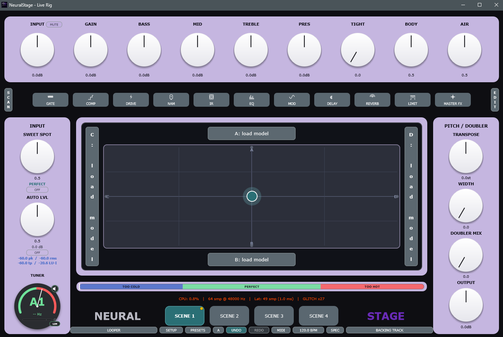

# NeuralStage

**Live guitar rig host built around NAM amp models.**  
Load up to four NAM captures, blend them on an XY pad, run them through VST3/LV2/AU/CLAP signal chains, switch complete rigs in milliseconds with scenes.



---

## Download

Pre-built binaries are on the [Releases](../../releases) page — no build required.

| Platform | Formats | File |
| -------- | ------- | ---- |
| Windows 10/11 x64 | Standalone · VST3 · CLAP | `NeuralStage-vX.X.X-Windows-x64-Setup.zip` |
| macOS 11+ (Universal) | Standalone · VST3 · CLAP | `NeuralStage-vX.X.X-macOS-Universal-Standalone.zip` |
| Linux x86_64 | Standalone · VST3 · AppImage | `NeuralStage-vX.X.X-Linux-x86_64-AppImage.zip` |
| Linux ARM64 (Raspberry Pi 5) | Standalone · VST3 · AppImage | `NeuralStage-vX.X.X-Linux-ARM64-AppImage.zip` |

### macOS — first launch

Apple blocks unsigned apps. Right-click the `.app` → **Open** → **Open** (first time only), or run:

```bash
xattr -cr NeuralStage.app
```

After the first launch it opens normally.

---

## Features

- **4-NAM XY morph** — blend four NAM amp captures simultaneously; equal-power crossfade with no centre dip
- **Scenes** — four complete rigs per preset (NAM models, XY position, signal chain, knob states); click-free switching with a brief audio fade
- **Signal chain strips** — host VST3, LV2, AU (macOS), and CLAP plugins per scene
- **Selectable NAM output mode** — Raw / Normalized / Calibrated (−18 dBu reference)
- **Tuner** — chromatic, always visible, mute-on-tune
- **Looper** — 60-second mono loop with overdub
- **Backing track player** — tempo-synced playback with MIDI transport control
- **Noise gate** — threshold / ratio / attack / release
- **Offline render** — bounce the current rig to a WAV file
- **MIDI learn** — any knob, button, or scene can be mapped to a footswitch or CC
- **Preset browser** — save / load complete 4-scene rigs
- **Raspberry Pi** — runs fullscreen on a 1024×600 touchscreen (Pi 5 tested)

---

## Building from source

### Prerequisites

All platforms need **CMake 3.24+**. JUCE 8 is fetched automatically via `FetchContent`.

#### Windows

Requires **Visual Studio 2022** and the **Steinberg ASIO SDK**.  
The ASIO SDK cannot be redistributed — download it free from [steinberg.net/developers](https://www.steinberg.net/developers/) and place it at `ThirdParty/ASIOSDK/`.

```powershell
.\build.ps1
```

#### macOS

```bash
cmake -S . -B Builds -G Ninja -DCMAKE_BUILD_TYPE=Release \
      -DCMAKE_OSX_ARCHITECTURES="arm64;x86_64" \
      -DCMAKE_OSX_DEPLOYMENT_TARGET=11.0
cmake --build Builds --parallel
```

#### Linux

```bash
sudo apt install cmake ninja-build build-essential pkg-config \
    libasound2-dev libjack-jackd2-dev libfreetype6-dev libfontconfig1-dev \
    libgl1-mesa-dev libx11-dev libxrandr-dev libxinerama-dev \
    libxcursor-dev libxcomposite-dev libpipewire-0.3-dev \
    libgtk-3-dev libwebkit2gtk-4.1-dev

git submodule update --init --recursive ThirdParty/NeuralAmpModelerCore
cmake -S . -B Builds -G Ninja -DCMAKE_BUILD_TYPE=Release
cmake --build Builds --parallel $(nproc)
```

---

## Stack

- **Framework:** JUCE 8 + CMake (C++20)
- **DSP core:** [NeuralAmpModelerCore](https://github.com/sdatkinson/NeuralAmpModelerCore)
- **Plugin hosting:** VST3 · LV2 · AU (macOS) · CLAP
- **Audio I/O:** ASIO + WASAPI + DirectSound (Windows) · CoreAudio (macOS) · ALSA + JACK + PipeWire (Linux)

---

## License

NeuralStage is free software released under the [GNU General Public License v3.0](LICENSE).  
Copyright © 2024–2026 Atij 666 Studio
